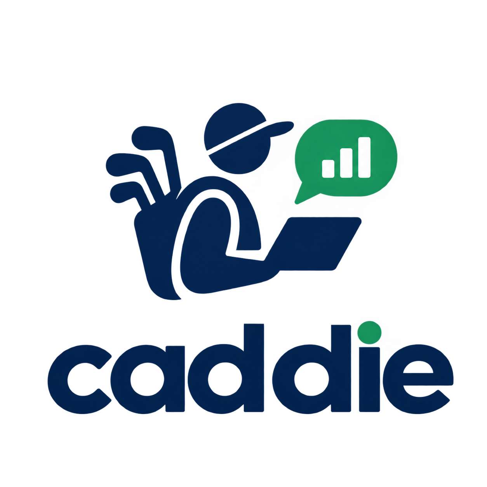

# Caddie

<table>
<tr>
<td></td>
<td>

> **cad·die** (noun)
> a companion to a golfer, providing both practical support and
> strategic guidance on the course, carrying clubs and offering advice
> on club selection, green reading, and course conditions, so the
> player can focus on playing.
> ([Wikipedia](https://en.wikipedia.org/wiki/Caddie))

</td>
</tr>
</table>

Caddie plays the same role for data. It carries the technical setup, the tooling,
and the technical detail so you can focus on the question you're
actually trying to answer. For people who don't write code, that means
asking questions of company data in plain language and getting a real
answer back. For data scientists, it means using AI coding tools to
build notebooks without the usual setup overhead.

It's a lightweight framework and set of skills packaged as a Claude
Code plugin. Caddie configures everything for the end user: run
`/caddie:install` once, then ask questions with `/caddie:ask`. Caddie
answers by building a [Marimo](https://marimo.io/pair) notebook and
serving it back, with no need to know anything about running a Marimo
server.

## Origin

This came out of a personal frustration: getting AI coding agents to work well with notebooks is clunky.  Organizations are investing in additional conversational analytics solutions even when they have invested in solutions like Claude Code or Codex for their entire organization.  This is because less technical analysts and business users have a steep learning curve figuring out how to use the existing tools and they are not optimized around asking questions of your data.  And even if you manage to get a bunch of MCPs and skills set up it is likely that the answer they get lives in an LLM chat transcript nobody can re-run. 

Caddie is an attempt to remove that friction for
people who aren't going to install Python, `uv`, or a notebook editor
themselves, while still producing something an analyst and data scientist will find useful since you can open, edit and share the notebooks Caddie creates afterward.

## Who it's for

- **Someone who wants an answer, not a coding environment.** They ask
  a question in Claude Code, in plain language. Caddie clarifies what's
  being asked, states a plan, runs it against the org's real data, and
  hands back a real answer plus a rendered notebook, opened for them
  automatically. The only setup requirement is authenticating to the
  org's data warehouse (currently Databricks). No Python,
  environment, or notebook literacy needed.
- **Someone who wants to go further.** The answer isn't a black box:
  every analysis is saved as an ordinary, reactive [Marimo](https://marimo.io)
  notebook (`notebook.py`, plain Python, git-diffable). A more advanced
  user can open it in a live editor (`/caddie:edit`), change a query by
  hand, and rerun it, without touching Caddie itself.

## Why the notebook stays reproducible

Typically a question answered by an AI assistant in chat is easy to produce and
hard to trust later: the query it ran, the exact data it saw, and
whether it would give the same answer today all live in a transcript,
not in anything re-runnable or shareable. Caddie's helps you follow a normal tried and tested data science workflow which means you get a re-runnable artifact not just an answer.  

We leverage Marimo notebooks - think IPython / Jupyter notebooks but written in plain python - perfect for coding agents.  The actual query, plan, and result live in the file itself, plain Python.  Anyone can open it, edit it and build on it.

Every generated notebook carries its own
dependency declaration (a PEP 723 header) and runs in its own isolated
`uv`-managed environment.  This means anything Caddie creates can be
shared with anyone - even people not using Caddie.  

For handing a
notebook to someone who doesn't have Caddie installed at all,
`/caddie:share` produces a second file, `notebook.portable.py`, fully standalone.
The file runs with nothing but `uv` on any machine. 

## How it's meant to be used

Caddie core is generic on purpose: it has no company-specific table
names, metric definitions, or business logic in it. The intended
pattern is to **install the plugin once and point it at your own
organization's config**: a config yaml (local file or URL) tells
`/caddie:install` which data science / analytics skill repo, skills,
and connector to use, and everyone else on the team just runs
`/caddie:install` to get a working setup, no plumbing knowledge
required, and no need to fork Caddie itself. Two things are supplied
per organization instead of being built into the harness:

- **Analytics skill(s)**: ordinary Claude Code skills that know your
  org's data model, table names, metric definitions, and business
  rules. You can wire in as many as you already have; Caddie doesn't
  pick between them, Claude Code's normal skill-selection does.
- **Data connector**: a small plugin that knows how to talk to your
  data backend. Databricks is the only one built so far; the interface
  is designed to accommodate others (Snowflake, PostgreSQL) later.

A third, currently in development, integration point is a **context/MCP
provider**: connecting Caddie to an organization's own MCP-based RAG
system, so `/caddie:ask` can search prior analyses before generating a
new one and index completed notebooks for future questions to reuse.
The interface for this is reserved in the design but not yet built.

All three sub systmes are pluggable via configuration, and do not require code changes to Caddie core.

## What it's built on

- [Marimo](https://marimo.io) notebooks (`.py` files, not `.ipynb`):
  pure Python, git-diffable, and reactive.
- [Marimo Pair](https://marimo.io/pair), a skill that drives a live Marimo kernel directly - 
  running code in the same runtime the user sees, inspecting live
  notebook state, and committing durable notebook changes. 
- [Plotly](https://plotly.com/python/) for charts, with a shared
  template so every notebook looks consistent regardless of which org
  or skill produced it.
- [uv](https://docs.astral.sh/uv/) for Python and dependency
  management, bootstrapped automatically so end users never install it
  by hand, and to give each notebook its own isolated environment (see
  "Why the notebook stays reproducible" above).

## Commands

Each of these is a Claude Code plugin skill (invoked with a namespaced
`/caddie:` slash command) backed by a real `caddie` CLI subcommand:

- `/caddie:install`: one-time laptop bootstrap. Installs required
  tooling, resolves the org's skill repo and connector, runs connector
  auth, and writes `~/.caddie/caddie.yaml`.
- `/caddie:ask "<question>"`: the entry point for a new analysis.
  Clarifies, plans, executes, and answers, ending with a notebook.
- `/caddie:list [pattern]`: list existing analysis projects.
- `/caddie:load <project>`: bring an existing project back into
  context, re-running its steps against live data.
- `/caddie:edit <project>`: open a project's notebook in a live
  Marimo editor, for hand-editing rather than reading a static export.
- `/caddie:add-dependency <project> <package>`: add a Python package
  to one project's notebook, isolated to that notebook's own sandboxed
  environment rather than caddie's own shared venv.
- `/caddie:share <project>`: generate a standalone copy of a project's
  notebook with no dependency on caddie itself, for handing to someone
  who doesn't have caddie installed.
- `/caddie:update`: refresh an existing setup (tooling, skill repo,
  dependencies, connector auth).

Caddie is built for and supported on Claude Code only.

## Installation

Mac only for now (Windows is a later phase).

Prerequisites: [Claude Code](https://claude.com/claude-code) and
credentials to authenticate against your org's data backend
(Databricks OAuth login, currently). Nothing else is required by
hand; `/caddie:install` checks for `uv` and installs it if it's
missing, installs the `caddie` CLI itself (from your org's config,
see step 2) if it isn't already on `PATH`, and everything after that
(the pinned Python version, dependencies, other tooling) is handled
by the install process itself.

1. Install the `caddie` plugin (via your organization's marketplace,
   once published, or a local plugin bundle while developing/testing):

   - **Claude Code (CLI)**: download the packaged zip and point
     `--plugin-dir` at it directly, no unzipping needed:

     ```
     curl -L -o caddie-plugin-0.0.1.zip https://raw.githubusercontent.com/mattwg/caddie/main/releases/caddie-plugin-0.0.1.zip
     claude --plugin-dir caddie-plugin-0.0.1.zip
     ```

     Then, inside that session:

     ```
     /plugin install caddie
     ```

   - **Claude Desktop**: go to Settings → Plugins, and add the
     downloaded zip file manually from there (Desktop doesn't take a
     `--plugin-dir` flag, so this has to be done through the menu).

2. Run install:

   ```
   /caddie:install
   ```

   It asks for a config yaml (a local path or URL) — your org's skill
   repo, which skill(s) to enable, which data connector to use (e.g.
   `databricks`), and a `caddie_source` (a git URL) it installs the
   `caddie` CLI from if it isn't already on `PATH`. If one is already
   known or discoverable, those answers are pre-filled and you just
   confirm them. It then logs you into the connector and sets up your
   notebooks folder (default `~/caddie/notebooks`).

3. Ask a question:

   ```
   /caddie:ask "<your question>"
   ```

`~/.caddie/caddie.yaml` is a local, per-user config file. To switch
skills, connector, or skill repo later, edit it directly and run
`/caddie:update`.
